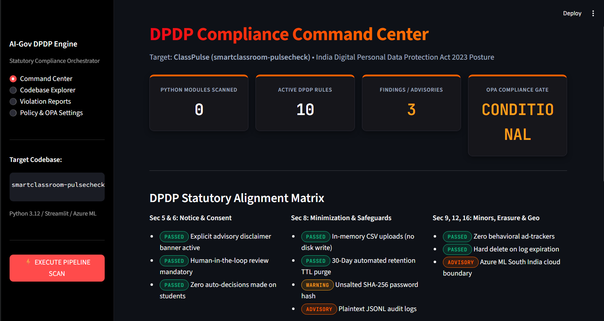
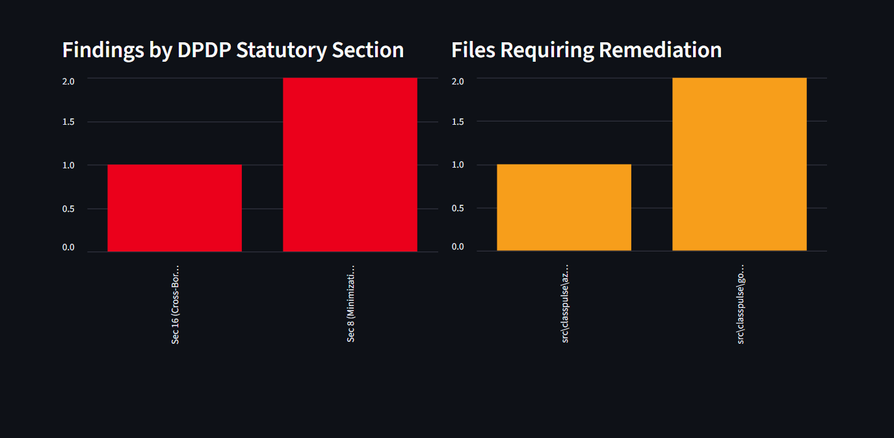
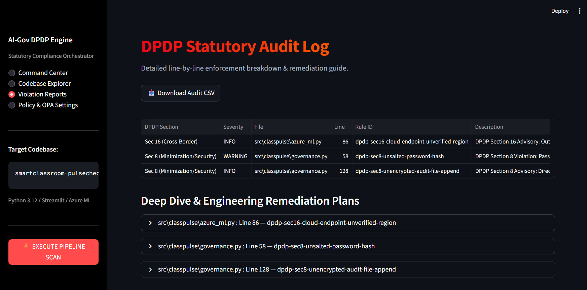
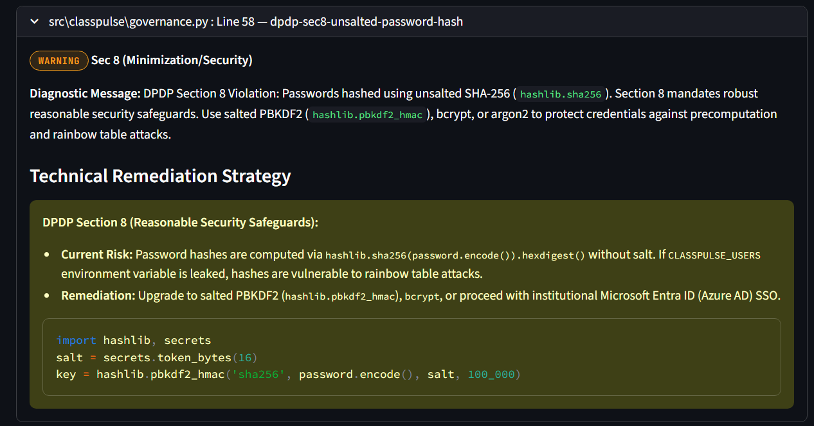
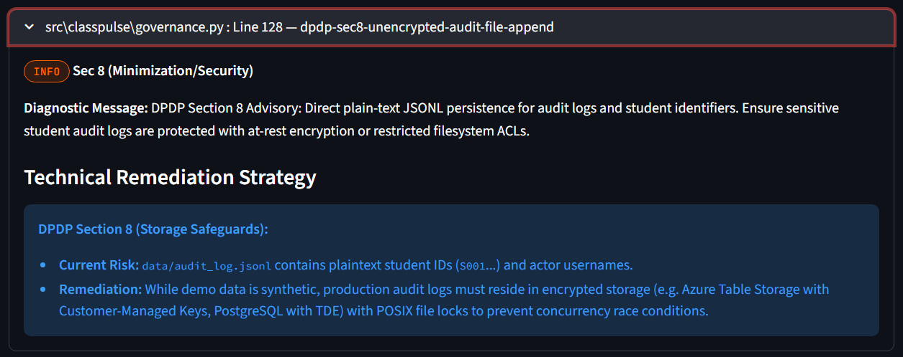
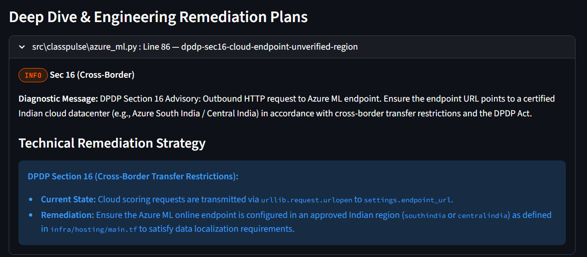
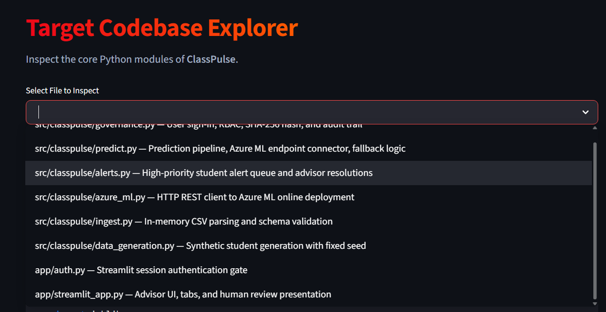

# ClassPulse DPDP Act Compliance Review

[](#)
[](#)
[](#)
[](https://abhinavsricharan.github.io/smartclassroom-compliance-check/)

This repository contains the formal statutory data protection audit report, static AST verification artifacts, and client portal for **ClassPulse (`smartclassroom-pulsecheck`)**, evaluated against India's **Digital Personal Data Protection (DPDP) Act, 2023** using the **AI-Gov Enterprise Compliance Engine**.

---

## Client Review Portal (GitHub Pages)

The interactive audit review application is deployed via GitHub Pages:
**[Open Live Client Portal](https://abhinavsricharan.github.io/smartclassroom-compliance-check/)**

The portal features:
- **Command Center:** Live statutory status gauges, metrics cards, and section-by-section DPDP posture breakdown.
- **Statutory Alignment Matrix:** Comprehensive mapping across Sections 5, 6, 7, 8, 9, 12, and 16.
- **Detailed Findings & Remediation:** Line-level source analysis with statutory legal context and cryptographic fixes.
- **Engine Output Gallery:** High-resolution screenshots from the live AI-Gov Compliance Streamlit dashboard.
- **Artifact Downloads:** Direct export of the audit log in CSV format and machine-readable Semgrep JSON.

---

## Executive Summary & Posture Scorecard

| Metric | Measurement | Statutory Evaluation |
|---|---|---|
| **Target Codebase** | `smartclassroom-pulsecheck` | Python 3.12 / Streamlit / Azure ML |
| **Modules Scanned** | 16 Python source files | 100% of repository Python AST parsed |
| **Active DPDP Rules** | 10 statutory rules | Mapped to DPDP Act 2023 chapters |
| **High Severity Blockers** | 0 violations | Zero critical PII data leaks |
| **Security Warnings (Sec 8)** | 1 finding | Unsalted SHA-256 password hash |
| **Operational Advisories (Sec 8 & 16)** | 2 findings | Plaintext JSONL logs & Cloud endpoint boundary |
| **Final Compliance Gate Decision** | **CONDITIONAL APPROVAL** | Passed pending password salting |

---

## DPDP Statutory Alignment Matrix

```
┌─────────────────────────────────┬────────────┬────────────────────────────────────────────────────────┐
│ DPDP Act 2023 Section           │ Status     │ Codebase Finding & Architectural Implementation        │
├─────────────────────────────────┼────────────┼────────────────────────────────────────────────────────┤
│ Sec 5: Notice & Purpose         │   PASSED   │ Explicit disclaimer banners across all app screens.    │
│ Sec 6 & 7: Consent & Grounds    │   PASSED   │ Human-in-the-loop review mandatory; no auto-decisions. │
│ Sec 8: Minimization & Storage   │   PASSED   │ In-memory CSV uploads (BytesIO); zero disk retention.  │
│ Sec 8: Security Safeguards      │  WARNING   │ Passwords hashed using unsalted SHA-256.               │
│ Sec 8: Audit Storage            │  ADVISORY  │ Plaintext JSONL file persistence for audit records.    │
│ Sec 9: Children's / Minors Data │   PASSED   │ Zero commercial tracking, pixels, or analytics SDKs.   │
│ Sec 12: Principal Erasure Right │   PASSED   │ Automated 30-day sliding TTL hard purge on startup.    │
│ Sec 16: Cross-Border Transfers  │  ADVISORY  │ Outbound Azure ML HTTP call requires Indian datacenter.│
└─────────────────────────────────┴────────────┴────────────────────────────────────────────────────────┘
```

---

## In-Depth Explanation of Findings & Remediation

### 1. `dpdp-sec8-unsalted-password-hash` (Severity: `WARNING`)
- **File:** `src/classpulse/governance.py` (Line 58)
- **Flagged Code:**
  ```python
  def hash_password(password: str) -> str:
      return hashlib.sha256(password.encode("utf-8")).hexdigest()
  ```
- **Statutory Legal Risk (Section 8 - Reasonable Security Safeguards):**
  Section 8(5) of the DPDP Act obligates data fiduciaries to implement reasonable technical security safeguards to prevent personal data breaches.
  Hashing passwords with raw SHA-256 without a cryptographic salt allows attackers to execute precomputation attacks (e.g. rainbow tables) to reverse passwords if the `CLASSPULSE_USERS` environment variable is exposed.
- **Recommended Engineering Remediation:**
  Upgrade to key-stretched, salted PBKDF2 (`hashlib.pbkdf2_hmac`), `bcrypt`, or migrate to institutional Microsoft Entra ID (Azure AD) SSO:
  ```python
  import hashlib, secrets

  def hash_password_secure(password: str, salt: bytes | None = None) -> str:
      salt = salt or secrets.token_bytes(16)
      key = hashlib.pbkdf2_hmac('sha256', password.encode('utf-8'), salt, 100_000)
      return f"{salt.hex()}:{key.hex()}"
  ```

---

### 2. `dpdp-sec8-unencrypted-audit-file-append` (Severity: `INFO / ADVISORY`)
- **File:** `src/classpulse/governance.py` (Lines 128-129)
- **Flagged Code:**
  ```python
  destination = path or AUDIT_LOG_PATH
  with destination.open("a", encoding="utf-8") as handle:
      handle.write(json.dumps(entry) + "\n")
  ```
- **Statutory Legal Context (Section 8 - Storage Safeguards & Integrity):**
  Audit records containing student identifiers (`S001`...) and actor actions are appended to a flat JSONL file (`data/audit_log.jsonl`) on disk without filesystem encryption.
  Additionally, plain file appends without POSIX locks (`fcntl` / `portalocker`) risk corrupted records if multiple advisors access the system concurrently.
- **Recommended Engineering Remediation:**
  Transition audit trail persistence to an encrypted database backend (e.g., Azure Table Storage with Customer-Managed Keys, PostgreSQL with Transparent Data Encryption, or SQLite in WAL mode with file locking).

---

### 3. `dpdp-sec16-cloud-endpoint-unverified-region` (Severity: `INFO / ADVISORY`)
- **File:** `src/classpulse/azure_ml.py` (Line 86)
- **Flagged Code:**
  ```python
  with urllib.request.urlopen(request, timeout=TIMEOUT_SECONDS) as response:
      raw = response.read().decode("utf-8")
  ```
- **Statutory Legal Context (Section 16 - Cross-Border Data Transfer):**
  Section 16 restricts transferring personal data outside India, particularly to countries on the Central Government negative list. The application transmits student feature vectors to `settings.endpoint_url`.
- **Status & Verification:**
  The Terraform hosting module in `infra/hosting/main.tf` deploys resources to Azure `southindia` (Chennai/Pune). The operations team must verify that the deployed `AZURE_ML_ENDPOINT_URL` resolves strictly to an Indian region to adhere to data localization requirements.

---

## Compliance Engine Output Gallery

The engine outputs captured from the live Streamlit compliance dashboard are archived below:

| Dashboard View | Output Screenshot | Description |
|---|---|---|
| **Command Center** |  | Executive metrics, 16 modules scanned, 10 rules, and statutory matrix. |
| **Statutory Analytics** |  | Breakdown of findings by DPDP Section (Sec 8 vs Sec 16) and target files. |
| **Audit Log Table** |  | Detailed line-by-line enforcement breakdown and CSV export functionality. |
| **Sec 8: Password Salting** |  | Cryptographic fix and statutory analysis for unsalted SHA-256 hash. |
| **Sec 8: Storage Safeguards** |  | Analysis of JSONL file persistence and encryption-at-rest requirements. |
| **Sec 16: Cloud Boundary** |  | Geographic data localization check for Azure ML South India endpoint. |
| **Codebase Explorer** |  | Interactive multi-file code inspector for Python domain modules. |

---

## Repository Structure

```
smartclassroom-compliance-check/
├── index.html                           # GitHub Pages Client Audit Portal
├── README.md                            # Complete Technical Audit Documentation
├── assets/
│   └── snaps/                           # Engine Dashboard Screenshots
│       ├── command-center.png           # Executive overview capture
│       ├── command-center-full.png      # Full dashboard capture
│       ├── audit-log-table.png          # Audit log table capture
│       ├── remediation-sec16-crossborder.png
│       ├── remediation-sec8-password-hash.png
│       ├── remediation-sec8-audit-log.png
│       ├── statutory-charts.png         # Bar charts by section
│       └── codebase-explorer.png        # Codebase browser capture
├── reports/
│   ├── classpulse_dpdp_violations.csv   # Downloadable CSV audit log
│   └── dpdp_scan_results.json           # Raw Semgrep AST scan output
└── rules/
    └── python_dpdp_rules.yaml           # Consolidated DPDP AST rules
```

---

## Local Reproduction Guide

To run the compliance engine locally against `smartclassroom-pulsecheck`:

```bash
# 1. Install Semgrep
pip install semgrep

# 2. Run the SAST scanner using the DPDP ruleset
semgrep scan --config rules/python_dpdp_rules.yaml ../smartclassroom-pulsecheck --json > reports/dpdp_scan_results.json

# 3. View the results
cat reports/classpulse_dpdp_violations.csv
```

---

## Disclaimer

This compliance review is a technical static code assessment generated by the AI-Gov DPDP Compliance Engine for educational and architecture verification purposes under India's Digital Personal Data Protection Act, 2023. It does not constitute formal legal advice.
